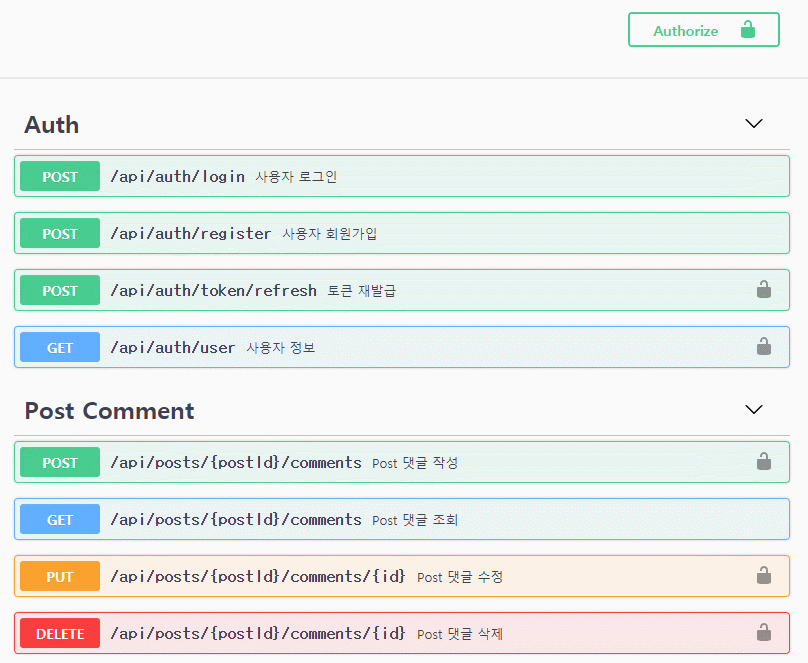

# ❯ JaeBook Server

Using TypeScript and Express.

### Project Features

- **Express with TypeScript**
- **Structure** Beautiful structure of controller, service, repository, model, middleware.
- **TypeORM** highly influenced by other ORMs, such as Hibernate, Doctrine and Entity Framework.
- **TypeDI** Dependency Injection for TypeScript.
- **Routing-Controllers** Structured, declarative, and beautifully configured class-based controller.
- **Helmet** Basic Security Features.
- **JWT** JWT security strategy using AccessToken, RefreshToken.
- **Jest, SuperTest** Unit Testing and E2E testing.
- **Sentry, Winston** Error logging and monitoring.
- **Swagger** API endpoint documentation.
- **ESLint** Find and fix problems in your TypeScript code.
- **Prettier** Prettier is an opinionated code formatter.

### Unit Testing and E2E testing

Test using In-memory Database.


### Error logging and monitoring


### Swagger



### Coding style automation with ESLint, Prettier and VSCode

By setting options for your team, you can keep your team's coding style consistent.


### Environment Variable Management

Delete `.sample` extension from` jaebook-server / config / `and use

```env
# APPLICATION
PORT=3000
API_PREFIX=/api

# MySQL DATABASE
DATABASE_HOST=127.0.0.1
DATABASE_PORT=3306
DATABASE_USERNAME=development
DATABASE_PASSWORD=development
DATABASE_NAME=development

# TypeORM
TYPEORM_SYNCHRONIZE=true
TYPEORM_LOGGING=true

# JWT
JWT_SECRET_ACCESS_KEY=test!@#$
JWT_SECRET_REFRESH_KEY=retest!@#$

# Swagger
SWAGGER_ROUTE=/api-docs

# Sentry
SENTRY_DSN=
```

### Build Setup

Steps to run this project:

1. Run `yarn install` command
2. Run `yarn build` command
3. Run `yarn start` command

### Tests

```sh
# e2e, unit tests
$ yarn test
```