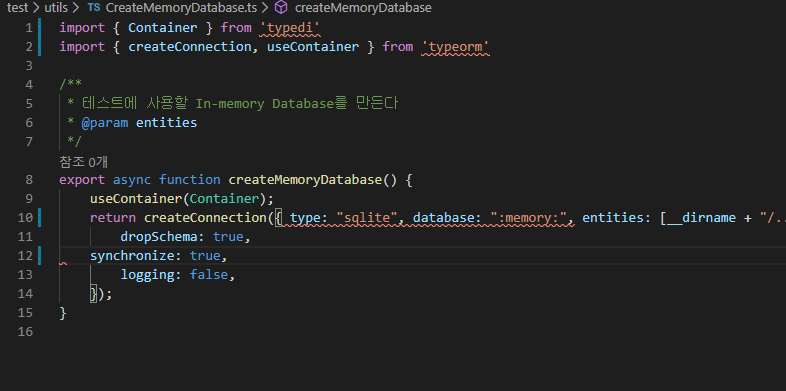

# ❯ JaeBook Server

Using TypeScript and Express.

Frontend : [JaeBook Client](https://github.com/JHyeok/jaebook-client)

### Article

- [Node.js 계층 구조 설계 및 환경 변수 관리](https://jhyeok.com/node-backend-structure/)

### Project Features

- **Express with TypeScript**
- **Structure** Beautiful structure of controller, service, repository, model, middleware.
- **TypeORM** highly influenced by other ORMs, such as Hibernate, Doctrine and Entity Framework.
- **TypeDI** Dependency Injection for TypeScript.
- **Routing-Controllers** Structured, declarative, and beautifully configured class-based controller.
- **Helmet** Basic Security Features.
- **JWT** JWT security strategy using AccessToken, RefreshToken.
- **Jest, SuperTest** Unit Testing and E2E testing.
- **Sentry, Winston** Error logging and monitoring.
- **Swagger** API endpoint documentation.
- **ESLint** Find and fix problems in your TypeScript code.
- **Prettier** Prettier is an opinionated code formatter.
- **Docker** Docker provides a simple and powerful developer experience, workflows and collaboration for creating applications.

### Unit Testing and E2E testing

Test using In-memory Database.


### Error logging and monitoring


### Swagger


### Coding style automation with ESLint, Prettier and VSCode

By setting options for your team, you can keep your team's coding style consistent.



### GitHub Action and Codecov


### Environment Variable Management

#### APP

Edit from `.env.{NODE_ENV}.sample` in `jaebook-server/config` to `.env.{NODE_ENV}` and replace the content.

```env
# APPLICATION
PORT=3000
API_PREFIX=/api

# MySQL DATABASE
DATABASE_HOST=127.0.0.1
DATABASE_PORT=3306
DATABASE_USERNAME=development
DATABASE_PASSWORD=development
DATABASE_NAME=development

# TypeORM
TYPEORM_SYNCHRONIZE=true
TYPEORM_LOGGING=true

# JWT
JWT_SECRET_ACCESS_KEY=test!@#$
JWT_SECRET_REFRESH_KEY=retest!@#$

# Swagger
SWAGGER_ROUTE=/api-docs

# Sentry
SENTRY_DSN=
```

#### Docker

Edit from `.env.sample` in the root to `.env` and replace the content.
This is the environment variable setting to be used for Docker.

```
# Set docker-compose environment
DB_ROOT_PASSWORD=testpass
DB_USER=test
DB_PASSWORD=test
DB_NAME=jaebook
```

### Build Setup

Steps to run this project:

1. Run `yarn install` command
2. Run `docker-compose up` command

### Development

1. Run `yarn install` command
2. Run `yarn dev` command

### Tests

```sh
# e2e, unit tests
$ yarn test
```